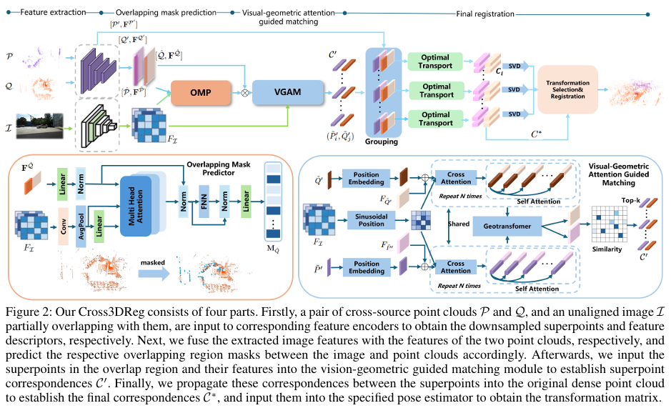
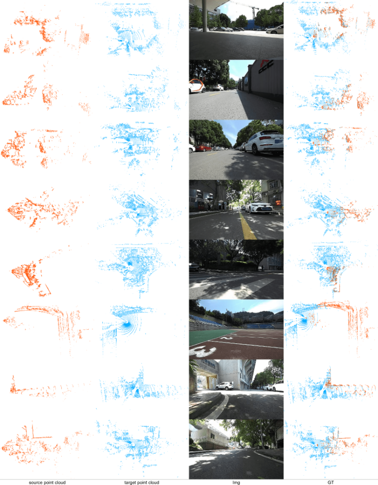

# Cross3DReg

Zongyi Xu, Zhongpeng Lang, Yilong Chen, Shanshan Zhao, Xiaoshui Huang, Yifan Zuo, Yan Zhang, Qianni Zhang, Xinbo Gao

## Introduction

Cross-source point cloud registration, which aims to align point cloud data from different sensors, is a fundamental task in 3D vision. However, compared to the same-source point cloud registration, cross-source registration faces two core challenges: the lack of publicly available large-scale real-world datasets for training the deep registration models, and the inherent differences in point clouds captured by multiple sensors. The diverse patterns induced by the sensors pose great challenges in robust and accurate point cloud feature extraction and matching, which negatively influence the registration accuracy. To advance research in this field, we construct Cross3DReg, the currently largest and real-world multi-modal cross-source point cloud registration dataset, which is collected by a rotating mechanical lidar and a hybrid semi-solid-state lidar, respectively. Moreover, we design an overlap-based cross-source registration framework, which utilizes unaligned images to predict the overlapping region between source and target point clouds, effectively filtering out redundant points in the irrelevant regions and significantly mitigating the interference caused by noise in non-overlapping areas. Then, a visual-geometric attention guided matching module is proposed to enhance the consistency of cross-source point cloud features by fusing image and geometric information to establish reliable correspondences and ultimately achieve accurate and robust registration. Extensive experiments show that our method achieves state-of-the-art registration performance.




## Cross3DReg Dataset
To facilitate the development of cross-source point cloud registration, we introduce a large-scale real-world Cross3DReg dataset that contains $13,231$ point cloud pairs captured by a rotating mechanical LiDAR and a hybrid semi-solid-state LiDAR. Images are also collected when the calibration between the RGB camera and the Lidars is unavailable. The data acquisition platform is a custom-built Unmanned Ground Vehicle (UGV), equipped with a 64-beam spinning mechanical LiDAR, a hybrid solid-state LiDAR, and an RGB camera. Specifically, the source point clouds are captured by the hybrid semi-solid-state LiDAR, while the target point clouds are acquired by the rotating mechanical LiDAR. The RGB camera captures front-view images of the scene to provide auxiliary visual information.
The Cross3D dataset can be downloaded from the [Cross3D](https://drive.google.com/file/d/1sEvQQYLJz7reggiM08GXg2Zatck2GLft/view?usp=sharing). The partial data visualization results are shown as follows:


## Code
Coming Soon.


## Result
We evaluate Cross3D on the Cross3D dataset as in [Geotransformer](https://arxiv.org/abs/2202.06688)

| Benchmark |  RRE  |  RTE  |  RR   |
| :-------- | :---: | :---: | :---: |
| Cross3D  | 6.683 |  1.010  | 87.2  |

## Citation
If you find the code or dataset useful for your research, please use the following BibTex entry.
```
@artical{xu2025cross3dreg,
      title={Cross3DReg: Towards a Large-scale Real-world Cross-source Point Cloud Registration Benchmark}, 
      author={Zongyi Xu and Zhongpeng Lang and Yilong Chen and Shanshan Zhao and Xiaoshui Huang and Yifan Zuo and Yan Zhang and Qianni Zhang and Xinbo Gao},
      year={2025},
      eprint={2509.06456},
      archivePrefix={arXiv},
      url={https://arxiv.org/abs/2509.06456}, 
}

## Acknowledgements
- [PREDATOR](https://github.com/prs-eth/OverlapPredator)
- [Geotransformer](https://github.com/qinzheng93/GeoTransformer)

